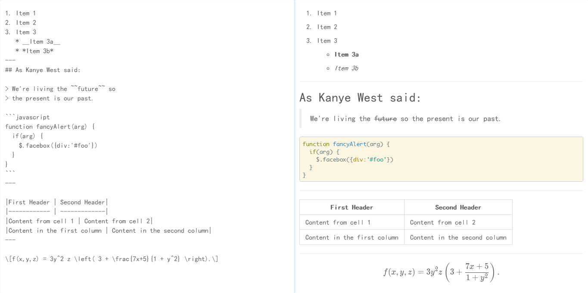

# MarkMe
> a simple Markdown Editor

## Feature

- Based on [electron](http://electron.atom.io/)
- Include a Markdown Parser written by myself
- Support code highlight by [highlightjs](https://highlightjs.org/)
- Support TeX math rendering by [KaTex](https://github.com/Khan/KaTeX)
- Support backup current file

## Development

- `npm install`
- `npm start`
- `npm run pack`

---
